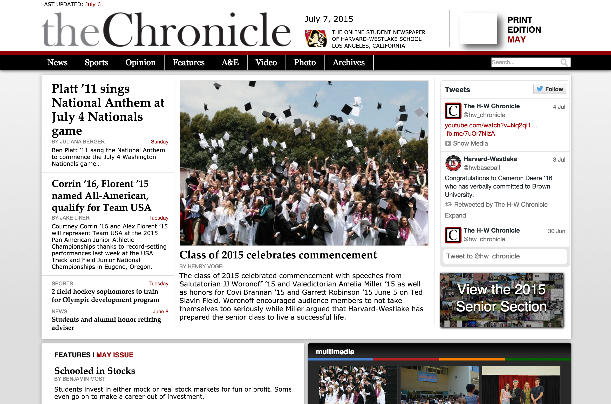
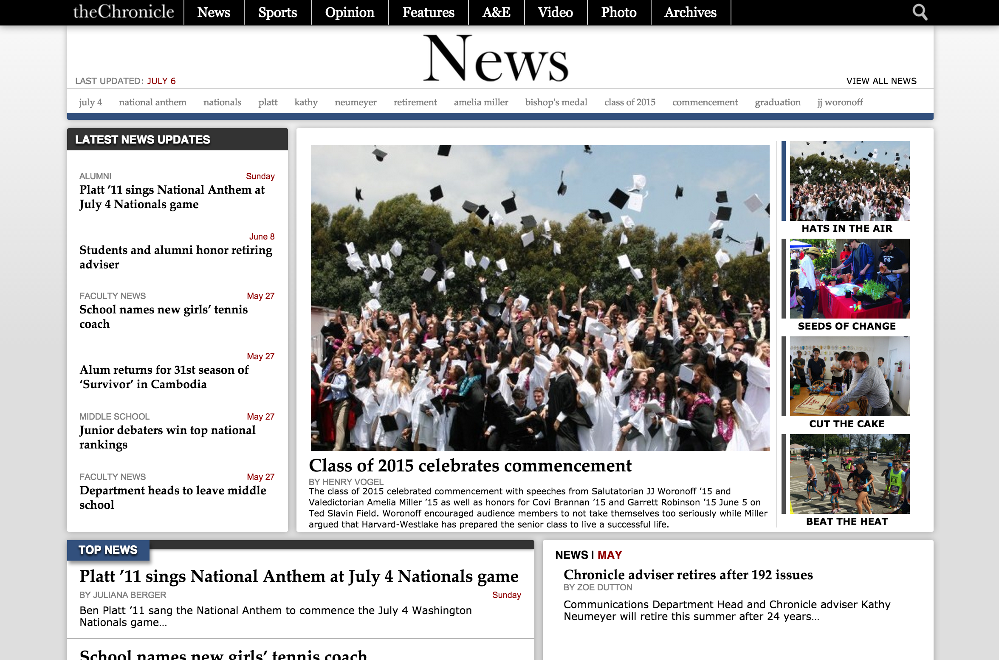
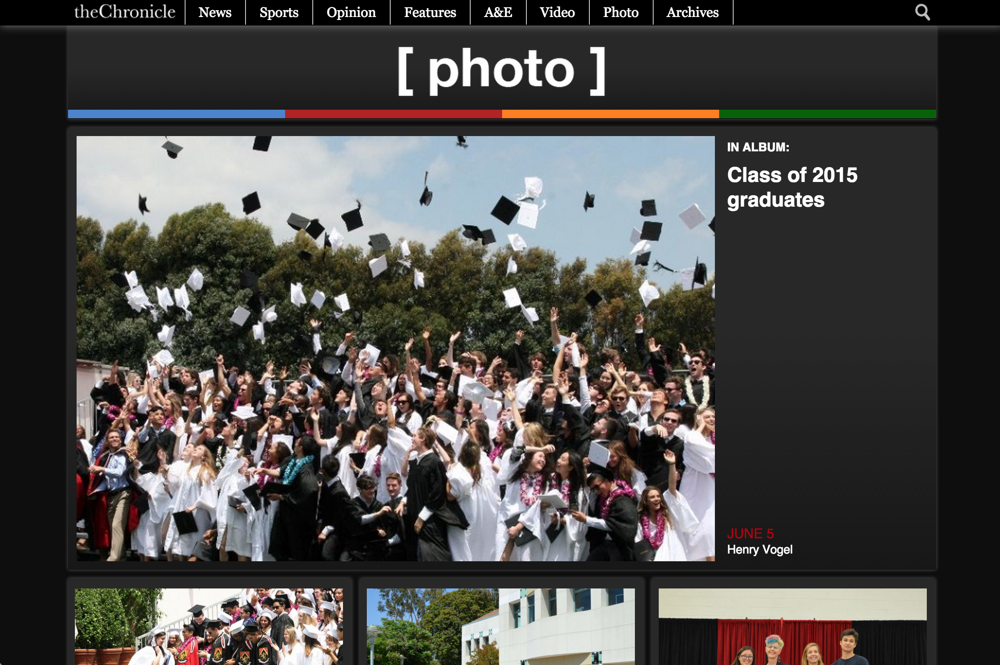
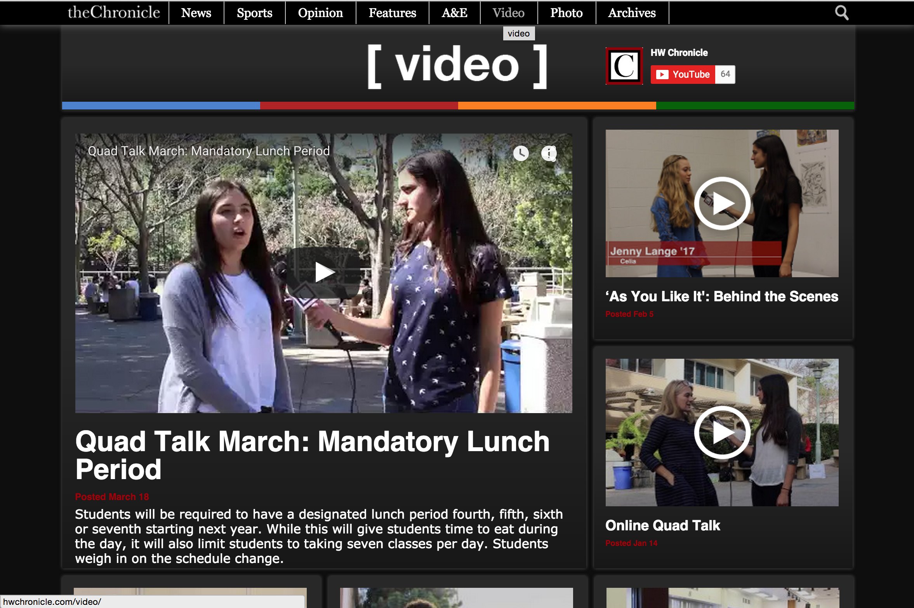

# [HW Chronicle](http://hwchronicle.com/)

HW Chronicle is the school newspaper of Harvard-Westlake High School. This website is the result of collaboration between myself and David Lim, the then-editor-in-chief of the newspaper. The site served to replace the unattractive and outdated newspaper website built by the school tech administrators on a DotNetNuke installation (which is just an extremely unfortunate name for a CMS framework) with a fresher completely redesigned installation of WordPress that would allow staff members to manage online content frustration-free.

## Site Structure
This site is structured as a WordPress installation with several custom post types that represent each type of article in order to provide clarity of separation for the different sections of the Chronicle staff. The project files in this repository are the contents of the WordPress theme that serves the website.

## Awards

The website was unexpectedly awarded the nation-wide Best High-School Newspaper Website Award by the NSPA, which is the most prestigious high-school journalism awards organization in the country. Staff celebrated all the awards HW Chronicle won that year with a huge cake and drinks. It was a good time. I believe the site also won awards from other organizations, but staff didn't really care about those other organizations so I guess they weren't that notable.

## License

HW Chronicle is [MPL licensed](./LICENSE?raw=true) and is available for limited public use under the license included in this repo.

## Screenshots

